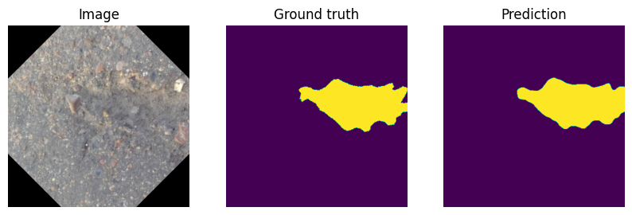
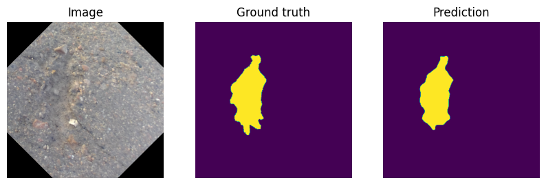
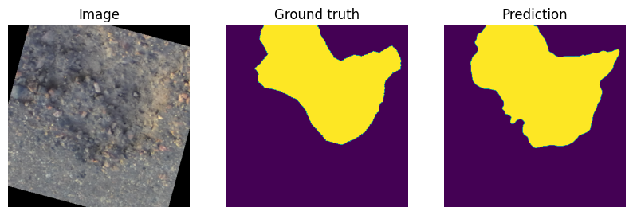

# pothole-segmentation
Training a computer vision task to segment potholes in images. This model was trained on the [pothole-600](https://sites.google.com/view/pothole-600/dataset) dataset.

# Setup

Create and Activate Virtual Environment

```	
python3 -m venv venv --system-site-packages
source venv/bin/activate
```

Install required packages

```
pip install -r requirements.txt
```

# Model Testing

Model trained on an augmented dataset containing 6600 images using a Feature Pyramid Network. This model was able to achive an IOU of 0.86





